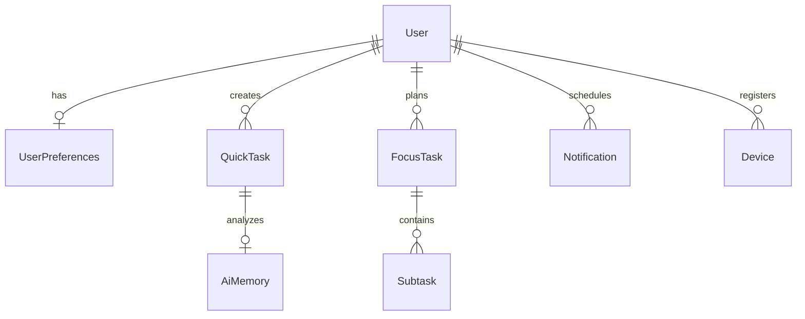

# Remell: AI-Powered Memory & Focus Assistant

Remell is a production-ready, cross-platform memory and focus application designed to act as your external brain. It helps you seamlessly capture quick spoken notes, automatically classify tasks, suggest subtasks via AI, track daily streaks, and conduct productive focus sessions.

---

## 🌟 Core Purpose & Experience

Traditional task managers force you to fill out complex forms (typing titles, picking categories, choosing dates, setting priorities). Remell eliminates this friction by leveraging **Continuous Speech-to-Text (STT)** and **Natural Language Processing (NLP)**.

- **Spoken Task Capture**: Tap the mic and talk naturally in English, Tagalog, or Taglish.
- **Intent & Language Parsing**: Remell automatically detects the language mix, extracts a clean, action-oriented task title, parses due dates/times, and schedules contextual reminders.
- **Action-Oriented Focus**: Organize work into quick items or deep focus sessions complete with checklists, custom timers, and gamified streak rewards.

---

## 🛠️ Technology Stack

Remell is built on a modern, decoupled architecture featuring a cross-platform client and a robust backend.

### Frontend (Client App)
* **Framework**: Flutter (Dart) - supporting Web, Mobile (iOS/Android), and Desktop compile targets.
* **State Management**: Riverpod (`flutter_riverpod`, `riverpod_annotation`) with code generation (`riverpod_generator`) for scalable state architecture.
* **Routing**: GoRouter (`go_router`) for declarative, deep-linkable routing.
* **Local Caching**: Isar Database (`isar`, `isar_flutter_libs`) for high-performance offline storage.
* **Networking**: Dio (`dio`) client with customized headers and request logging.
* **Design & Typography**: Google Fonts (`inter`), Lucide Icons, and custom canvas-based particle/animation systems (e.g., custom confetti & flame painters).
* **Permissions**: `permission_handler` for proactive OS access prompts.

### Backend (Server)
* **Runtime**: Node.js with TypeScript (`tsx` for dev watch mode).
* **Web Framework**: Express.js.
* **Database Client (ORM)**: Prisma.
* **Database**: PostgreSQL (hosted on Supabase).
* **Caching & Queue Worker**: Redis with BullMQ (used for database pruning, notification dispatching, and background jobs).
* **Security & Authentication**:
  * `argon2` for secure password hashing.
  * `jsonwebtoken` (JWT) for stateless access & refresh tokens.
  * `helmet` and `express-rate-limit` for DDoS and brute-force mitigation.
  * Social Sign-in clients (`google-auth-library`, `apple-signin-auth`).
* **Mailing**: Nodemailer.

---

## 🗄️ Database Architecture

Remell uses PostgreSQL managed via Prisma. The relational schema is structured as follows:



### Models Summary:
1. **User**: Credentials, timezone, language preferences, and profile details.
2. **UserPreferences**: UI configurations including layout choices (`homeLayout: option_a`), wake/sleep times (for smart notification suggestions), and sorting rules.
3. **QuickTask**: Memory capture tasks. Stores titles, raw notes, status (`pending`, `completed`, `archived`), priority, and fields for `aiClassification` and `confidenceScore`.
4. **FocusTask**: Dedicated time-blocked tasks including estimated durations, completion progress, and relationships to granular subtask items.
5. **Subtask**: Indented checklist items under a specific focus session.
6. **Notification**: Background alert schedules (`scheduled`, `sent`, `opened`, `status`).
7. **AiMemory**: Classifications, confidence ratings, and AI-suggested checklist steps.
8. **Device**: Registered push tokens (Firebase Cloud Messaging) and OS metadata.

---

## 🚀 Getting Started

### Backend Setup
1. Navigate to the backend directory:
   ```bash
   cd backend
   ```
2. Install dependencies:
   ```bash
   npm install
   ```
3. Configure your environmental variables in `.env` (using `.env.example` as a template):
   ```env
   PORT=5000
   DATABASE_URL="postgresql://..."
   REDIS_URL="redis://localhost:6379"
   JWT_SECRET="your_secret"
   ```
4. Run Prisma migrations:
   ```bash
   npx prisma migrate dev
   ```
5. Start the development server:
   ```bash
   npm run dev
   ```

### Frontend Setup
1. Navigate to the frontend directory:
   ```bash
   cd frontend
   ```
2. Install dependencies:
   ```bash
   flutter pub get
   ```
3. Run the code generation watch task (for Riverpod/Isar files):
   ```bash
   dart run build_runner watch --delete-conflicting-outputs
   ```
4. Start the application:
   - For web local dev:
     ```bash
     flutter run -d web-server --web-port 8080 --web-hostname 0.0.0.0
     ```
   - For native Chrome:
     ```bash
     flutter run -d chrome
     ```
